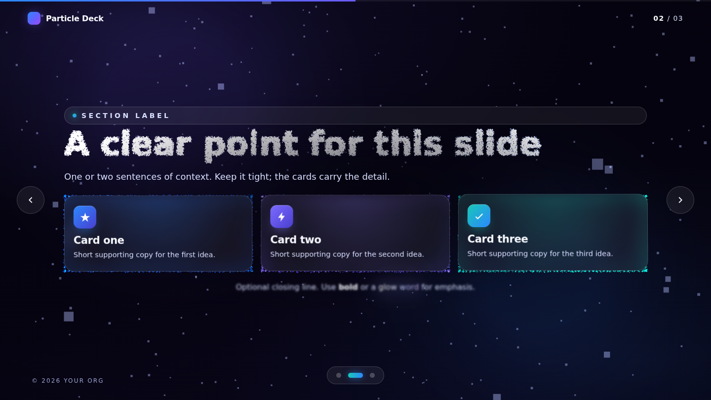
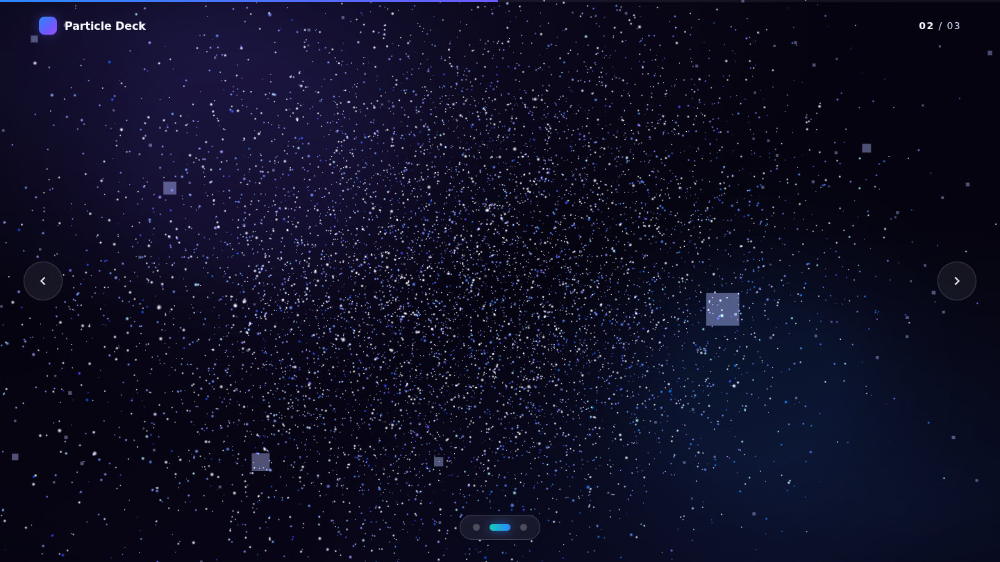

# Particle Engine — Presentation Platform

A reusable **3D particle presentation engine**. One WebGL particle field (~34,000 GPU
points) **builds each slide out of particles** — the headline and containers are sampled
from the live DOM, so on every change the shapes shatter into a storm and reassemble into
the next slide. Restrained cosmic theme, crisp body copy, Framer-style flows, full controls.

This branch (`particle-engine-template`) is the **platform/template**. Decks are authored
by writing HTML only — branch off this, fill in content, brand it, ship it.


## Make a deck

```bash
git checkout particle-engine-template
git checkout -b deck/<your-deck-name>
# edit index.html — duplicate slides, tag the headline + containers, write content
python3 -m http.server 8000   # preview at http://localhost:8000
```

You tag which elements the particles build, right in the HTML:

```html
<section class="slide content">
  <div class="slide-inner">
    <h2 data-particle="text">Headline built from particles</h2>
    <article class="card pop" data-particle="box" data-accent="#2b88ff"> … </article>
  </div>
</section>
```

- `data-particle="text"` → the headline's words are rendered in particles
- `data-particle="box"` → the container's outline is drawn in particles; the card fades in inside

Dots, counter, and navigation update automatically from the number of slides.
Full guide → **[AUTHORING.md](AUTHORING.md)**.

| Content (particle headline + containers) | Mid-transition (shatter / storm) |
|---|---|
|  |  |

## What the engine gives you

- **Particle construction** — the headline and containers are sampled from the live DOM and
  built from particles; on change they shatter → storm → reassemble (custom GLSL shader with
  arc displacement so they visibly fly between shapes)
- **Restrained cosmic theme** — cool white/violet/blue with sparse accent pops
- **Glowing, radiating key words** + crisp readable text (focal scrim + dark halo)
- **Framer-style flows** — depth-based reveals, card cascades, per-slide camera moves
- **Full controls** — arrows, ↑/↓, Space, Page keys, Home/End, wheel, touch swipe,
  on-screen arrows, dot navigator, progress bar, mouse parallax
- **Zero build, zero runtime network** — Three.js + GSAP vendored locally; deploys as-is to
  GitHub Pages

## Controls

- **← / →**, **↑ / ↓**, **Space**, **Page Up/Down** — move between slides
- **Home / End** — first / last slide
- **Wheel / swipe** — advance · **Mouse move** — parallax

## Tech

- **[Three.js](https://threejs.org/) r160** — WebGL + custom particle shader
- **[GSAP](https://gsap.com/) 3.12** — morph driver, camera, DOM reveals
- Vanilla JS/CSS, single `index.html`, no framework or bundler

## Project layout

```
index.html              # the deck (content) + import map
AUTHORING.md            # how to author a deck on this engine
assets/
  css/styles.css        # theme tokens + glass components + chrome
  js/scene.js           # particle construction engine (DOM → particles)
  js/app.js             # slide controller, navigation, GSAP flows
  vendor/               # three.js + gsap (local, offline-friendly)
docs/preview/           # template screenshots
```

---

*Built for the AI Activation sessions. Restrained "fun universe" theme.*
