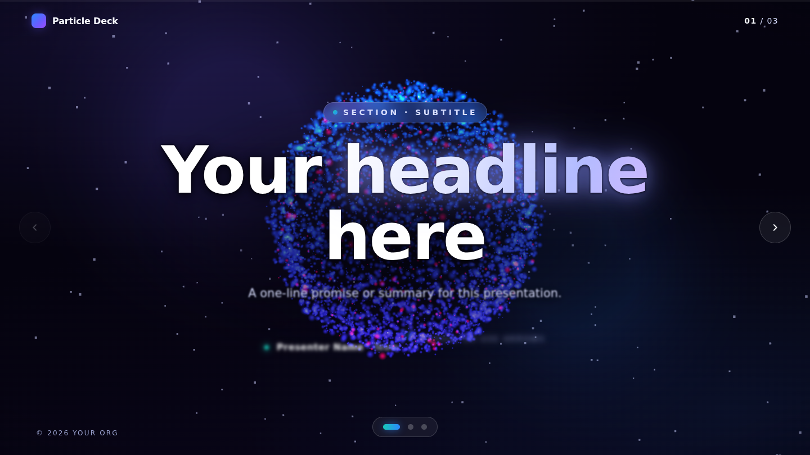
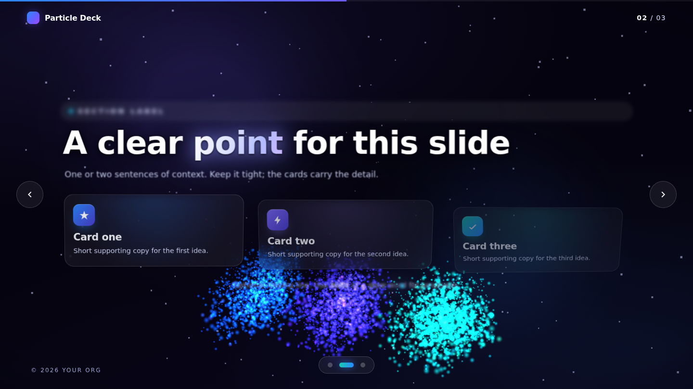
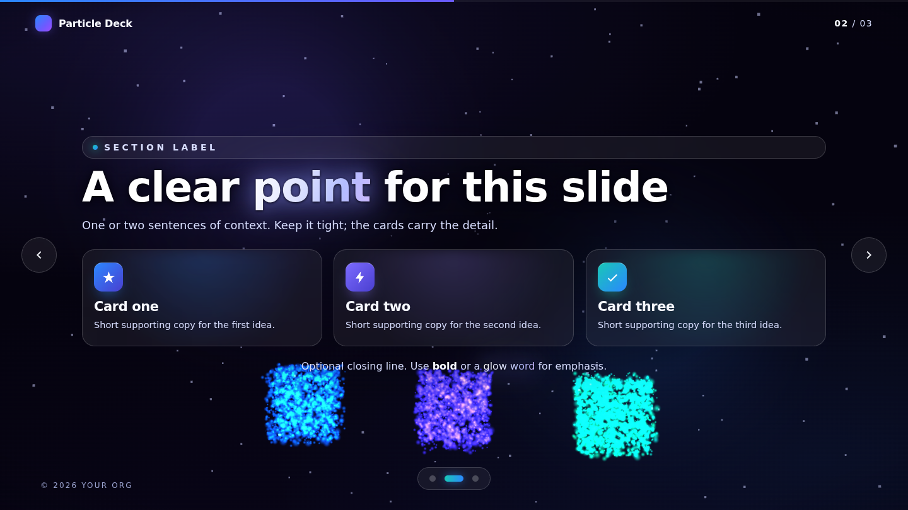

# Particle Engine — Presentation Platform

A reusable **3D particle presentation engine**. One WebGL particle field (~13,000 GPU
points) morphs between formations as you move through slides, with a restrained cosmic
theme, glowing key words, Framer-style flows, and full slide controls.

This branch (`particle-engine-template`) is the **platform/template**. Decks are authored
by writing HTML only — branch off this, fill in content, brand it, ship it.



## Make a deck

```bash
git checkout particle-engine-template
git checkout -b deck/<your-deck-name>
# edit index.html — duplicate slides, set data-formation, write content
python3 -m http.server 8000   # preview at http://localhost:8000
```

Each slide declares its particle artwork in HTML:

```html
<section class="slide content" data-formation="clusters:3">
  <div class="slide-inner"> … your content … </div>
</section>
```

**Formations:** `orb · core · core-center · clusters:N · split · ring · grid · stream · burst`

Dots, counter, and navigation update automatically from the number of slides.
Full guide → **[AUTHORING.md](AUTHORING.md)**.

| Whirlwind mid-transition (shapes dancing) | Content slide (crisp DOM + formation) |
|---|---|
|  |  |

## What the engine gives you

- **Whirlwind transitions** — on each slide change the particle field swirls and dances in
  the background as it morphs between the slide shapes (arc displacement + an enveloped spin
  that peaks mid-transition and settles at rest). Content is always crisp DOM on top.
- **Restrained cosmic theme** — cool white/violet/blue with sparse accent pops
- **Glowing, radiating key words** + crisp readable text (focal scrim + dark halo)
- **Framer-style flows** — depth-based reveals, card cascades, per-slide camera moves
- **Full controls** — arrows, ↑/↓, Space, Page keys, Home/End, wheel, touch swipe,
  on-screen arrows, dot navigator, progress bar, mouse parallax
- **Zero build, zero runtime network** — Three.js + GSAP vendored locally; deploys as-is to
  GitHub Pages

## Controls

- **← / →**, **↑ / ↓**, **Space**, **Page Up/Down** — move between slides
- **Home / End** — first / last slide
- **Wheel / swipe** — advance · **Mouse move** — parallax

## Tech

- **[Three.js](https://threejs.org/) r160** — WebGL + custom particle shader
- **[GSAP](https://gsap.com/) 3.12** — morph driver, camera, DOM reveals
- Vanilla JS/CSS, single `index.html`, no framework or bundler

## Project layout

```
index.html              # the deck (content) + import map
AUTHORING.md            # how to author a deck on this engine
assets/
  css/styles.css        # theme tokens + glass components + chrome
  js/scene.js           # particle engine + formation registry
  js/app.js             # slide controller, navigation, GSAP flows
  vendor/               # three.js + gsap (local, offline-friendly)
docs/preview/           # template screenshots
```

---

*Built for the AI Activation sessions. Restrained "fun universe" theme.*
