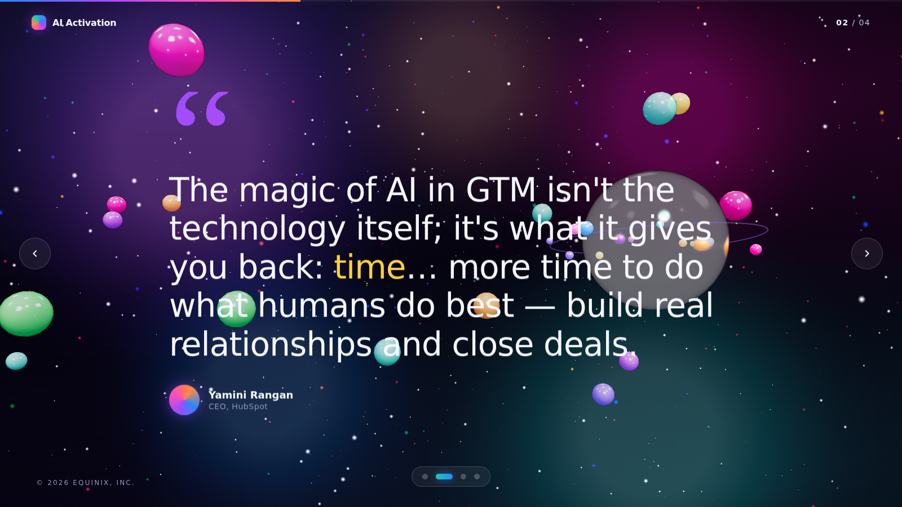
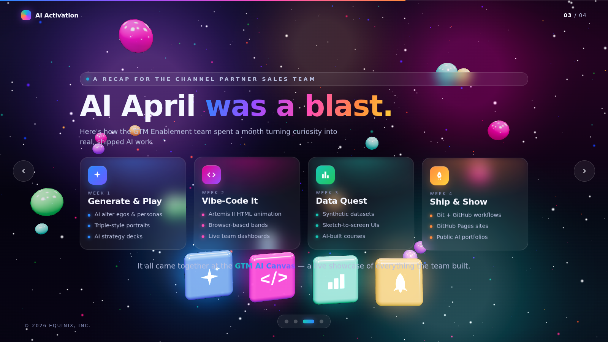
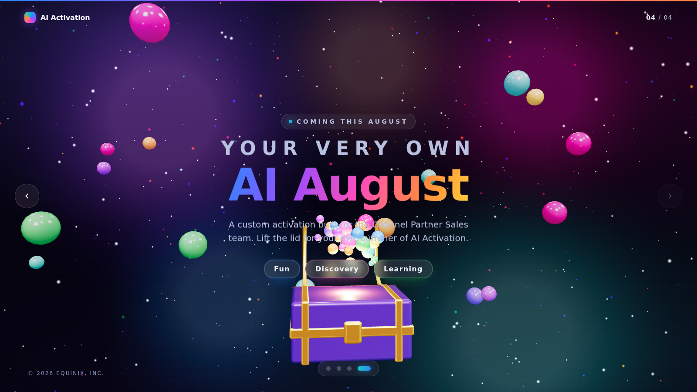

# AI Activation — Channel Partner Sales

An interactive, **3D HTML presentation** of the *AI Activation for Channel Partner Sales* deck.
Real WebGL artwork, Framer-style motion, and a playful "Fun Universe" theme built on the
Microsoft Fluent fun-color palette.


## What's inside

Four slides, each with its own piece of **procedurally-generated 3D art** (no flat image
cut-outs — everything is real geometry rendered with Three.js):

| # | Slide | 3D artwork |
|---|-------|-----------|
| 1 | **A summer of AI Activation** (cover) | A glass "AI" orb — a transmissive crystal shell holding glowing colour lobes, ringed by orbiting beads |
| 2 | **The quote** (Yamini Rangan, HubSpot) | The orb drifts aside, calm and slowly spinning |
| 3 | **AI April was a blast** (recap) | Four glowing 3D week badges (✦ sparkle · `</>` code · 📊 chart · 🚀 rocket) beneath glassmorphic content cards |
| 4 | **Your very own AI August** (reveal) | A 3D treasure chest that **lifts its lid** and fountains colourful spheres — "lift the lid for your own summer of AI" |

All four sit inside a shared cosmos: a 3,600-point twinkling starfield, additive nebula
clouds, floating bokeh spheres, image-based lighting, and pointer-driven camera parallax.

| Quote | Recap | AI August |
|---|---|---|
|  |  |  |

## Controls

- **← / →**, **↑ / ↓**, **Space**, **Page Up/Down** — move between slides
- **Home / End** — jump to first / last slide
- **Mouse wheel / trackpad** — scroll to advance
- **Touch swipe** — on mobile / tablet
- **On-screen** — arrows, progress bar, and the dot navigator
- Move the mouse to gently parallax the whole scene

## Running it

It's a fully static site with **no build step** and **no network dependencies** — Three.js
and GSAP are vendored under `assets/vendor/`.

```bash
# any static server works, e.g.
python3 -m http.server 8000
# then open http://localhost:8000
```

> ES module import maps require the page to be served over `http(s)://`
> (opening `index.html` via `file://` won't load the modules).

### Deploy to GitHub Pages

Push this repo and enable **Settings → Pages → Deploy from branch** (root). The site is
served as-is.

## Tech

- **[Three.js](https://threejs.org/) r160** — WebGL rendering, `MeshPhysicalMaterial`
  glass/transmission, `RoomEnvironment` IBL, custom shader starfield
- **[GSAP](https://gsap.com/) 3.12** — slide flows and the 3D choreography (elastic
  reveals, the chest opening, camera moves)
- Vanilla JS, CSS, and a single `index.html` — no framework, no bundler

## Project layout

```
index.html              # markup + slide content + import map
assets/
  css/styles.css        # theme, glassmorphism, chrome, responsive
  js/scene.js           # all the 3D: cosmos + per-slide hero artwork
  js/app.js             # slide controller, navigation, GSAP flows
  vendor/               # three.js + gsap (local, offline-friendly)
docs/preview/           # screenshots used in this README
```

---

*© 2026 Equinix, Inc. — content from the AI Activation for Channel Partner Sales deck.*
