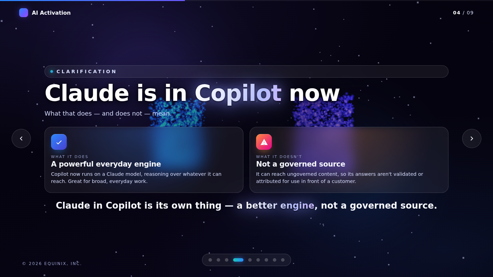
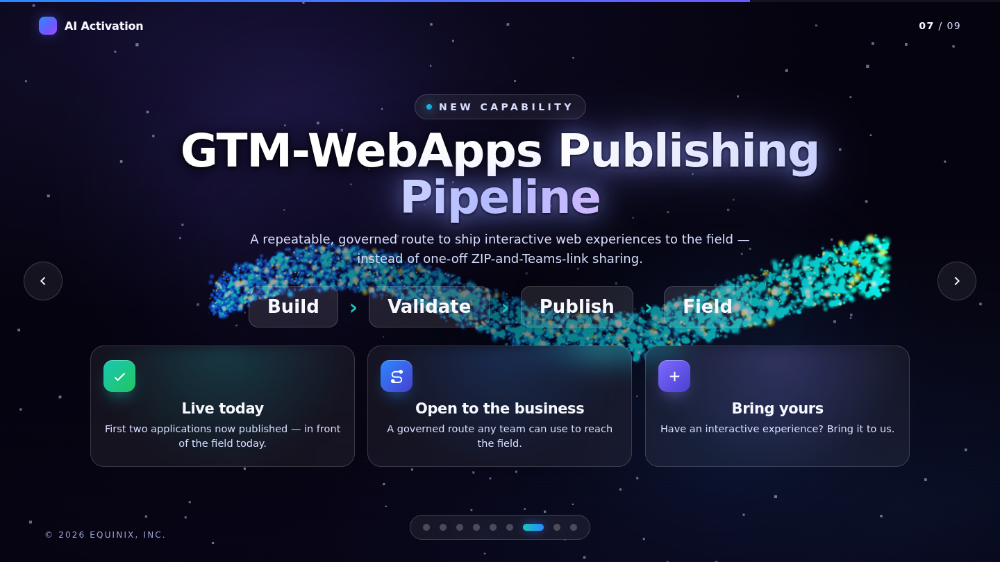
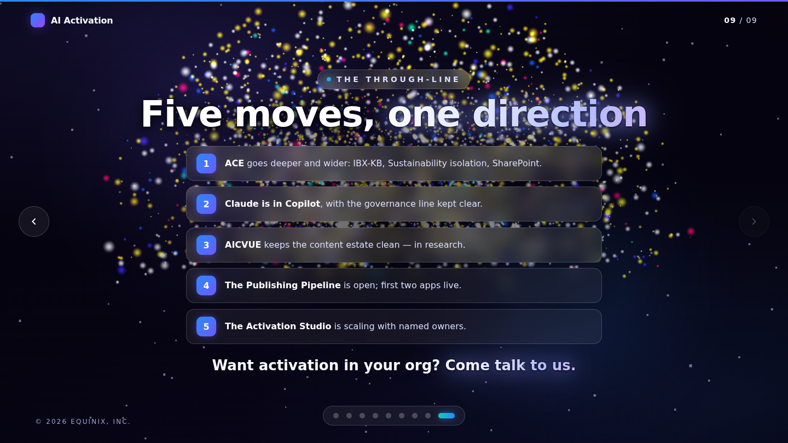

# AI Activation — What's New, What's Next

An interactive, **3D HTML presentation** for the AI Activation monthly learning session —
covering **ACE, Claude in Copilot, AICVUE, the Publishing Pipeline, and the Activation
Studio**. A single **morphing particle field** (~13,000 GPU points) flies between a
different formation for every slide.


## What's inside

The whole deck is driven by **one WebGL particle system** that transforms shape to shape.
Particles arc and fly between formations on every transition, then breathe and sway at rest.
Each formation is chosen to match the slide's idea:

| # | Slide | Particle formation |
|---|-------|--------------------|
| 1 | **What's New, What's Next** (cover) | glowing **sphere** |
| 2 | **Meet ACE** | a bright, dense **core** |
| 3 | **ACE gets deeper, and wider** | **three clusters** (IBX-KB · Sustainability · SharePoint) |
| 4 | **Claude is in Copilot now** | a **split** into two clouds — what it does / what it doesn't |
| 5 | **Getting access** | an orbital **ring** |
| 6 | **AICVUE** | a scanning **lattice grid** |
| 7 | **Publishing Pipeline** | a flowing **stream** behind Build › Validate › Publish › Field |
| 8 | **The Activation Studio** | **four clusters** under the named owners |
| 9 | **Five moves, one direction** | a celebratory **burst** finale |

The palette is deliberately restrained — cool white / violet / blue with sparse accent
pops — and the **key words glow and radiate**. Text sits over a soft focal scrim with a
tight dark halo so it stays crisp over the bright field.

| Clarification (split) | Pipeline (stream) | Finale (burst) |
|---|---|---|
|  |  |  |

## Controls

- **← / →**, **↑ / ↓**, **Space**, **Page Up/Down** — move between slides
- **Home / End** — jump to first / last slide
- **Mouse wheel / trackpad** — scroll to advance
- **Touch swipe** — on mobile / tablet
- **On-screen** — arrows, progress bar, and the dot navigator
- Move the mouse to gently parallax the whole scene

## Running it

A fully static site with **no build step** and **no network dependencies** — Three.js and
GSAP are vendored under `assets/vendor/`.

```bash
python3 -m http.server 8000
# then open http://localhost:8000
```

> ES module import maps require the page to be served over `http(s)://`
> (opening `index.html` via `file://` won't load the modules).

### Deploy to GitHub Pages

Push this repo and enable **Settings → Pages → Deploy from branch** (root).

## Tech

- **[Three.js](https://threejs.org/) r160** — WebGL rendering; a custom GLSL particle
  shader handles the morph (eased mix between formations + arc displacement + idle motion)
- **[GSAP](https://gsap.com/) 3.12** — drives the morph (`uMix`), camera moves, and the
  depth-based DOM reveals
- Vanilla JS, CSS, and a single `index.html` — no framework, no bundler

## Project layout

```
index.html              # markup + all nine slides + import map
assets/
  css/styles.css        # theme, glass components, chrome, responsive
  js/scene.js           # the morphing particle field + formations + shader
  js/app.js             # slide controller, navigation, GSAP flows
  vendor/               # three.js + gsap (local, offline-friendly)
docs/preview/           # screenshots used in this README
```

---

*© 2026 Equinix, Inc. — content from the AI Activation Session deck.*
